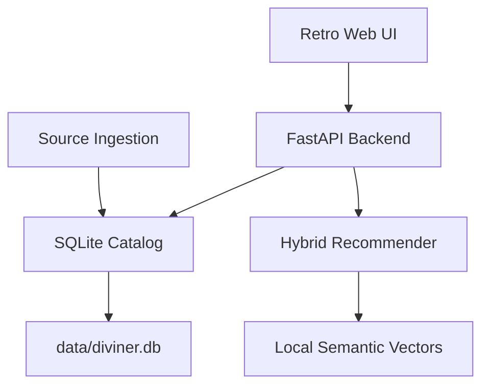

# Diviner

Diviner helps you find webnovels based on what you actually feel like reading.

Instead of only searching by exact genres, you can describe a mood, trope, character type, or story vibe in normal language. For example:

```text
i wanna get spooked
```

```text
completed academy progression fantasy with a smart main character
```

```text
cozy cultivation story with farming
```

Diviner then ranks novels by how closely they match your request, while also showing each novel's rating and why it matched.

## Why Use It

Most webnovel discovery is annoying because you either need to know the exact title already or browse huge genre lists manually. Diviner is meant to work more like asking a friend:

- Tell it the kind of story you want.
- Get a ranked list of matching novels.
- Sort by best match or highest rating.
- Open the source page when something looks interesting.

The current version comes with sample data from RoyalRoad, Webnovel, Wuxiaworld, ScribbleHub, and major web serials, so you can try it immediately. It can also ingest more metadata from supported sources into a local SQLite database.

## How To Use It

1. Start the app locally.
2. Open `http://127.0.0.1:8000`.
3. Type what you want to read.
4. Choose whether to rank by best match or highest rating.
5. Click `Find novels`.

The app creates a local SQLite catalog automatically at `data/diviner.db`. When the app starts, it tries to fill the catalog with 100 novels from each startup-supported source. Right now that means RoyalRoad, AO3, and FanFiction.net. The first launch can take longer because it is fetching source metadata.

To reset it with the bundled starter catalog, run:

```bash
python3 scripts/ingest_sample.py
```

For faster meaning-based search, you can build local embeddings after the first run:

```bash
python3 scripts/build_embeddings.py
```

This creates `data/embeddings.json` locally. After that, searches like `i wanna get spooked` can match horror and supernatural novels even when you do not type the exact genre.

## Installation

Clone the repo first:

```bash
git clone https://github.com/ACHYouth/Diviner.git
cd Diviner
```

On macOS, use `python3`:

```bash
python3 -m venv .venv
source .venv/bin/activate
pip3 install -r requirements.txt
python3 -m uvicorn app.main:app --reload
```

On Linux, this usually works:

```bash
python -m venv .venv
source .venv/bin/activate
pip install -r requirements.txt
uvicorn app.main:app --reload
```

On Windows PowerShell:

```powershell
python -m venv .venv
.venv\Scripts\Activate.ps1
pip install -r requirements.txt
python -m uvicorn app.main:app --reload
```

Then open:

```text
http://127.0.0.1:8000
```

## How It Works

Diviner currently uses a hybrid recommendation approach:

- Trope and keyword matching for specific requests like `completed`, `academy`, `cultivation`, or `villain protagonist`
- Local semantic vectors for mood and meaning-based searches
- SQLite storage for novels, tags, genres, source counts, popularity signals, and ingestion history
- Rating as a small ranking signal
- Explainable match reasons shown beside each result

## Add Or Refresh Novels

Diviner automatically tries to fetch 100 novels each from RoyalRoad, AO3, and FanFiction.net when the app starts. You can also refresh a source manually:

```bash
python3 scripts/ingest.py royalroad
python3 scripts/ingest.py scribblehub
python3 scripts/ingest.py ao3
python3 scripts/ingest.py fanfiction
python3 scripts/ingest.py webnovel
python3 scripts/ingest.py all
```

You can still override the default when you want a smaller or larger import:

```bash
python3 scripts/ingest.py all --limit 25
```

Current source adapters:

| Source | Status |
| --- | --- |
| RoyalRoad | Startup ingestion, paginates public listing pages |
| AO3 | Startup ingestion, paginates public work search |
| FanFiction.net | Startup ingestion, paginates public category pages |
| ScribbleHub | Adapter exists, but startup ingestion is disabled because Cloudflare blocks plain requests |
| Webnovel | Placeholder until a stable public metadata path is selected |
| Wuxiaworld | Placeholder until a clean metadata source is selected |

`data/diviner.db` and `data/embeddings.json` are generated locally and ignored by git.

## Current Architecture



## How To Test It

Run the unit tests:

```bash
python3 -m pytest
```

Expected result:

```text
6 passed
```

You can also do a quick backend check:

```bash
python3 -c "from app.catalog import Catalog; from app.recommender import recommend; novels=Catalog().load(); rows=recommend('i wanna get spooked', novels); print(rows[0].novel.title)"
```

Expected output should be a horror or supernatural result, such as:

```text
My House of Horrors
```

## API

### Health

```http
GET /api/health
```

### List novels

```http
GET /api/novels?sort=rating
```

Supported sort values:

- `rating`
- `title`
- `source`
- `popularity`

### Source counts

```http
GET /api/sources
```

### Ingestion history

```http
GET /api/ingestion-runs
```

### Recommend

```http
POST /api/recommend
Content-Type: application/json

{
  "query": "I want a completed progression fantasy with academy setting and smart main character",
  "sort_by": "similarity",
  "limit": 10
}
```

Supported sort values:

- `similarity`
- `rating`

## Project Layout

```text
app/
  catalog.py
  main.py
  models.py
  recommender.py
  semantic.py
  scrapers/
data/
  sample_novels.json
frontend/
  index.html
  styles.css
  app.js
scripts/
  ingest.py
  build_embeddings.py
  ingest_sample.py
tests/
```

## Next Build Steps

1. Expand each source adapter with better pagination, deduping, and source-specific popularity fields.
2. Add background ingestion jobs so the catalog can refresh without blocking the app.
3. Add admin controls for source health, import counts, and failed ingestion runs.
4. Add user feedback like liked/disliked/clicked results for future model training.
5. Split the frontend for Cloudflare Pages or GitHub Pages while hosting the API separately.
