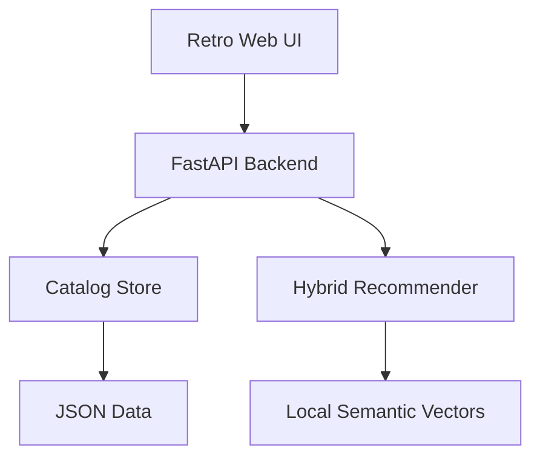

# Diviner

Diviner helps you find webnovels based on what you actually feel like reading.

Instead of only searching by exact genres, you can describe a mood, trope, character type, or story vibe in normal language. For example:

```text
i wanna get spooked
```

```text
completed academy progression fantasy with a smart main character
```

```text
cozy cultivation story with farming
```

Diviner then ranks novels by how closely they match your request, while also showing each novel's rating and why it matched.

## Why Use It

Most webnovel discovery is annoying because you either need to know the exact title already or browse huge genre lists manually. Diviner is meant to work more like asking a friend:

- Tell it the kind of story you want.
- Get a ranked list of matching novels.
- Sort by best match or highest rating.
- Open the source page when something looks interesting.

The current version comes with sample data from RoyalRoad, Webnovel, Wuxiaworld, ScribbleHub, and major web serials, so you can try it immediately.

## How To Use It

1. Start the app locally.
2. Open `http://127.0.0.1:8000`.
3. Type what you want to read.
4. Choose whether to rank by best match or highest rating.
5. Click `Find novels`.

For better meaning-based search, build local embeddings once:

```bash
python3 scripts/build_embeddings.py
```

This creates `data/embeddings.json` locally. After that, searches like `i wanna get spooked` can match horror and supernatural novels even when you do not type the exact genre.

## Installation

Clone the repo first:

```bash
git clone https://github.com/ACHYouth/Diviner.git
cd Diviner
```

On macOS, use `python3`:

```bash
python3 -m venv .venv
source .venv/bin/activate
pip3 install -r requirements.txt
python3 scripts/build_embeddings.py
python3 -m uvicorn app.main:app --reload
```

On Linux, this usually works:

```bash
python -m venv .venv
source .venv/bin/activate
pip install -r requirements.txt
python scripts/build_embeddings.py
uvicorn app.main:app --reload
```

On Windows PowerShell:

```powershell
python -m venv .venv
.venv\Scripts\Activate.ps1
pip install -r requirements.txt
python scripts/build_embeddings.py
python -m uvicorn app.main:app --reload
```

Then open:

```text
http://127.0.0.1:8000
```

## How It Works

Diviner currently uses a hybrid recommendation approach:

- Trope and keyword matching for specific requests like `completed`, `academy`, `cultivation`, or `villain protagonist`
- Local semantic vectors for mood and meaning-based searches
- Rating as a small ranking signal
- Explainable match reasons shown beside each result

## Current Architecture



## How To Test It

Run the unit tests:

```bash
pytest
```

Expected result:

```text
6 passed
```

You can also do a quick backend check:

```bash
python -c "from app.catalog import Catalog, SAMPLE_DATA; from app.recommender import recommend; novels=Catalog(SAMPLE_DATA).load(); rows=recommend('i wanna get spooked', novels); print(rows[0].novel.title)"
```

Expected output should be a horror or supernatural result, such as:

```text
My House of Horrors
```

## API

### Health

```http
GET /api/health
```

### List novels

```http
GET /api/novels?sort=rating
```

Supported sort values:

- `rating`
- `title`
- `source`

### Recommend

```http
POST /api/recommend
Content-Type: application/json

{
  "query": "I want a completed progression fantasy with academy setting and smart main character",
  "sort_by": "similarity",
  "limit": 10
}
```

Supported sort values:

- `similarity`
- `rating`

## Project Layout

```text
app/
  catalog.py
  main.py
  models.py
  recommender.py
  semantic.py
  scrapers/
data/
  sample_novels.json
frontend/
  index.html
  styles.css
  app.js
scripts/
  build_embeddings.py
  ingest_sample.py
tests/
```

## Next Build Steps

1. Add real RoyalRoad ingestion through public pages or community API wrappers where permission is clear.
2. Add Webnovel ingestion carefully because the site is more restrictive and dynamic.
3. Store catalog data in SQLite or Postgres instead of JSON.
4. Add user feedback like liked/disliked/clicked results for future model training.
5. Split the frontend for Cloudflare Pages or GitHub Pages while hosting the API separately.
