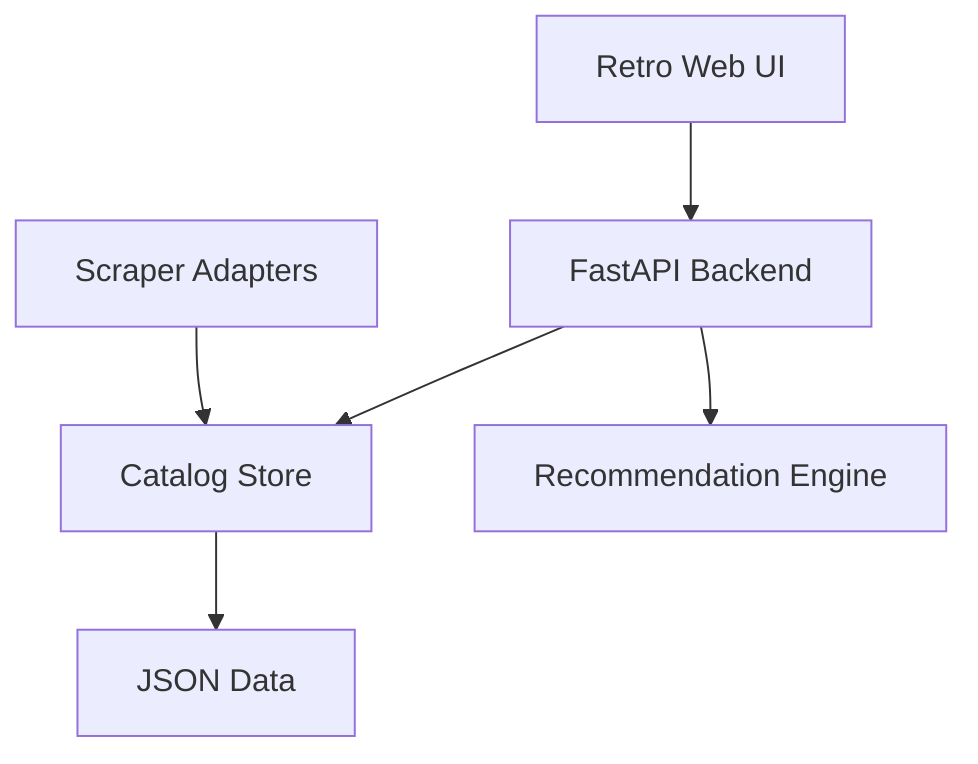

# Diviner

A Python webapp for collecting webnovel metadata and recommending novels from natural language requests.

The first build includes:

- A FastAPI backend
- A minimalist retro static UI
- Sample RoyalRoad/Webnovel-style catalog data
- Recommendation scoring by query similarity, genre match, tag match, and rating
- Scraper adapter structure for RoyalRoad and Webnovel sources
- API endpoints for searching, sorting, and future ingestion

## Current Architecture



## How To Try It Locally

Clone the repo first:

```bash
git clone https://github.com/ACHYouth/Diviner.git
cd Diviner
```

On macOS, use `python3`:

```bash
python3 -m venv .venv
source .venv/bin/activate
pip3 install -r requirements.txt
python3 -m uvicorn app.main:app --reload
```

On Linux, this usually works:

```bash
python -m venv .venv
source .venv/bin/activate
pip install -r requirements.txt
uvicorn app.main:app --reload
```

On Windows PowerShell:

```powershell
python -m venv .venv
.venv\Scripts\Activate.ps1
pip install -r requirements.txt
python -m uvicorn app.main:app --reload
```

Then open this in your browser:

```text
http://127.0.0.1:8000
```

The page starts with sample data, so you can test the recommendation engine right away without scraping anything.

Try a query like:

```text
I want a completed academy progression fantasy with a smart main character
```

## How To Test It

Run the unit tests:

```bash
pytest
```

Expected result:

```text
2 passed
```

You can also do a quick backend check:

```bash
python -c "from app.catalog import Catalog, SAMPLE_DATA; from app.recommender import recommend; novels=Catalog(SAMPLE_DATA).load(); rows=recommend('completed academy progression fantasy smart protagonist', novels); print(rows[0].novel.title)"
```

Expected output:

```text
Mother of Learning
```

## API

### Health

```http
GET /api/health
```

### List novels

```http
GET /api/novels?sort=rating
```

Supported sort values:

- `rating`
- `title`
- `source`

### Recommend

```http
POST /api/recommend
Content-Type: application/json

{
  "query": "I want a completed progression fantasy with academy setting and smart main character",
  "sort_by": "similarity",
  "limit": 10
}
```

Supported sort values:

- `similarity`
- `rating`

## Project Layout

```text
app/
  catalog.py
  main.py
  models.py
  recommender.py
  scrapers/
data/
  sample_novels.json
frontend/
  index.html
  styles.css
  app.js
scripts/
  ingest_sample.py
tests/
```

## Next Build Steps

1. Add real RoyalRoad ingestion through public pages or community API wrappers where permission is clear.
2. Add Webnovel ingestion carefully because the site is more restrictive and dynamic.
3. Store catalog data in SQLite or Postgres instead of JSON.
4. Train a simple model after enough labeled preference data exists.
5. Split the frontend for Cloudflare Pages or GitHub Pages while hosting the API separately.
